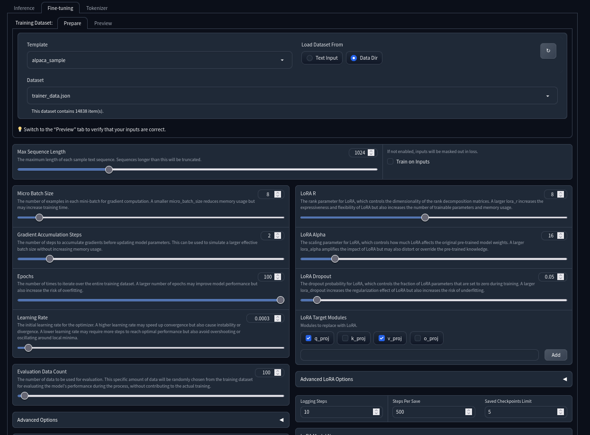

# Phrenia

Чат-бот для [Discord] с возможностью дообучения на своих историях сообщений

###### Алгоритм парсинга сообщений довольно сыроват на данный момент

### Запустить локально

- Установить [Python 3.11] и [Git]
- Откройте терминал в любой папке
- Склонировать репозиторий `git clone https://github.com/userXinos/phrenia.git && cd phrenia`
- Скопировать файл `simple.config.json` как `config.json` и заполнить поля
  - `token` - токен для работы с ботом можно получить в [Discord Developer Portal]
  - `model` - базовая модель для генерации ответов, путь или имя с [Huggingface]
  - `peftModel` - путь до вашей LoRA модели
  - `classifierModel` - модель классификатора для оценки диалогов
  - `load4bit` - загрузка модели в 4 бит, true - если не хватает vRaw
  - `systemPrompt` - системный промпт
  - `temperature` - температура семплирования
  - `contextMaxLen` - количество сообщений из чата для контекста модели

- Установить зависимости и запустить:

<details>
  <summary>Подготовить окружение с помощью conda</summary>

###### Необязательно, но рекомендуется использовать [Conda] для установки зависимостей и создания отдельного окружения, чтобы не получать конфликты с другими пакетами.

  ```bash
  conda create -y python=3.11 -n phrenia
  conda activate phrenia
  ```
</details>

```bash
pip install -r requirements.lock.txt
python main.py
```

### Обучить на своих данных discord чата

#### Экспорт чата

- Скачать и запустить программу для экспорта чата [DiscordChatExporterPlus]
- Выбрать чат. Путь до `путь/до/phrenia/raw`. Формат `JSON`, нажать на кнопку `More` и выключить - `Format markdown` и `Download assets`
- Запустить `python parser.py`
> Процесс не быстрый. Убирает весь мусорный контекст, группирует диалоги по ответам, а потом используя модель классификатора проходит весь чат и ищет диалоги сам
> Ryzen 5 5600 160к диалогов молол примерно 5 часов по 5 итераций в секунду.
- Итоговый файл можно найти в `путь/до/phrenia/dataset/trainer_data.json`. Он будет в формате alpaca, его можно использовать для обучения

#### Создание LoRa модели

Вы можете использовать любой другой софт для создания LoRA модели, но мы будем использовать [LLaMA-LoRA Tuner] для примера

- Скачать [LLaMA-LoRA Tuner] и следуя инструкциям Readme подготовить окружение
- Базовая модель (`base_model`) должна быть как в config.json, скопировать `trainer_data.json` в `LLaMA-LoRA-Tuner/data/datasets/`
- Можно запускать
- Переходим на вкладку `Fine-tunnig`.



Поля которые нужно заполнить:
 - `Template` выбрать **alpaca-simple**, 
 - `Load Dataset from` - переключить на **Data Dir**
 - `Dataset` выбрать наш **trainer_data.json**
 - `Max Sequence Length` - Влияет на максимальную длину текста в наборе датасета. Все данные из датасета, длина которых превышает эту, не будут использоваться в обучении
 - `Train on Inputs` - Убрать галочку. В нашем случае их нет
 - `Micro Batch Size` - Если у вас есть свободная видеопамять, установка большего размера пакета позволит использовать больше видеопамяти и взамен обеспечит более качественное обучение.
 - `Gradient Accumulation Steps` - Вроде ускоряет обучение, поставил на 2
 - `Epochs` - Ставьте на максимум, всё равно остановим раньше
 - `Learning Rate` - Лучше не трогать
 - `Evaluation Data Count` - Проверки нашей модели во время обучения, можете включить, будет рисовать 2 графика с прогрессом
 - `Advanced Options` - если сразу после старта обучения вылетает ошибка типа **CUDA out of memory** добавьте туда этот код `{"auto_find_batch_size": true}`
 - `Steps Per Save` - 200-500
 - `LORA Model Name` - Имя вашей модели, в будущем можно выбрать это имя в `Continue from Model` для продолжения с чекпоинта

Теперь можно запустить обучение

> Когда вы запустите обучение, в окне консоли и на странице будут записываться отчеты, которые включают, среди прочего, числовое значение с именем `train_loss`. Вначале оно будет высоким, а затем постепенно будет становиться все ниже и ниже.
> 
> «Loss» в мире обучения ИИ теоретически означает «насколько модель близка к совершенству». 0 означает «абсолютно совершенный». Это рассчитывается путем измерения разницы между тем, что модель выводит именно тот текст, который вы ее обучаете, и тем, что модель на самом деле выводит.
> 
> На практике хороший LLM должен иметь очень сложный переменный набор идей, протекающих в искусственной голове, поэтому потеря 0 будет означать, что модель сломалась и разучилась думать о чем-либо, кроме того, чему вы ее обучали.
> 
> Таким образом, по сути, Loss — это балансирующая игра: вы хотите, чтобы значение было достаточно низкой - чтобы модель понимала ваши данные, но достаточно высокой, чтобы она не забывала все остальное. Обычно, если Loss опускается ниже 1.0, он начнет забывать свои предыдущие воспоминания, и вам следует прекратить обучение. В некоторых случаях вы можете предпочесть снизить его до 0.5 (если вы хотите, чтобы это было очень-очень предсказуемо). Разные цели имеют разные потребности, поэтому не бойтесь экспериментировать и посмотреть, что лучше всего подойдет вам.
> 
> Примечание. Если вы видите, что потеря начинается с или внезапно переходит ровно на 0, вероятно, в вашем процессе обучения что-то пошло не так (например, повреждение модели). 
>
> 
> из [text-generation-webui/wiki/05]

#### Загрузить вашу LoRa модель
- Добавьте путь к вашей модели в config.json в поле `peftModel`


[Discord]: https://discordapp.com/
[Conda]: https://conda.io/projects/conda/en/latest/user-guide/install/index.html
[Python 3.11]: https://www.python.org/downloads/release/python-3119/
[Git]: https://git-scm.com/downloads
[Discord Developer Portal]: https://discord.com/developers/applications
[Huggingface]: https://huggingface.co/models?other=text-generation-inference
[DiscordChatExporterPlus]: https://github.com/nulldg/DiscordChatExporterPlus/releases/latest
[LLaMA-LoRA Tuner]: https://github.com/zetavg/LLaMA-LoRA-Tuner
[text-generation-webui/wiki/05]: https://github.com/oobabooga/text-generation-webui/wiki/05-%E2%80%90-Training-Tab#loss
